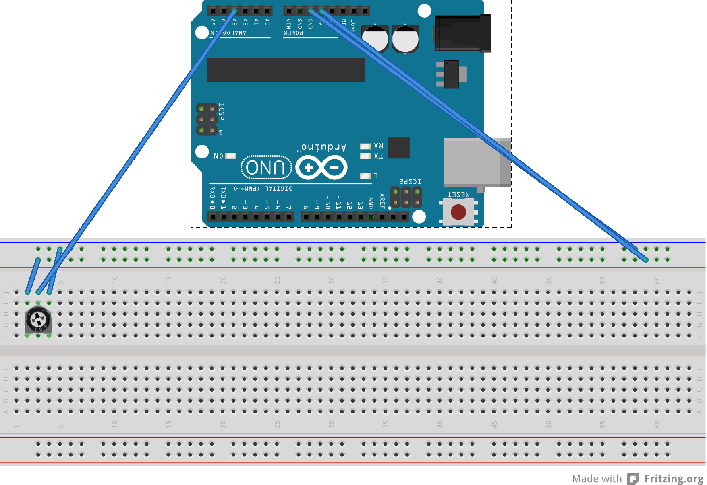

potsquare
=========

Installation
--------------
First connect your potentiometer to your computer like so. Make sure your wires be connected tightly!

## Breadboard/Illustration



Then in terminal:
```
git clone https://github.com/Cheeseen/potsquare.git
cd potsquare
npm install
node src/server
```

Once the server is ready go to localhost:8080 and play!
    
